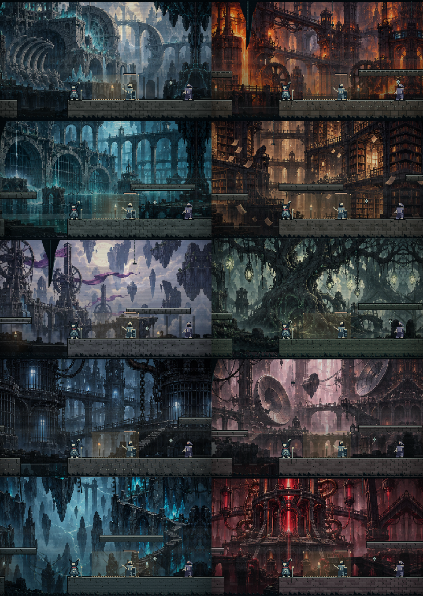

# MOONPAW: Ashen Vow

**Ten stolen names. One way to break the bell.**

A dark 2D pixel platformer by **Adnan Naous**. Guide Noir through the sealed city, recover the witnesses' names, and confront Regent Ilyan. Running, variable-height jumping, wall jumping, rolling and timed strikes share a finite stamina bar. Layered painted scenery, torch pools, fog and particles create depth with planar gameplay.

Version **0.3.0** remakes combat, settings and the visual world. Each chapter has three sealed encounters with pursuing enemies, health, stamina, dodges, committed attack warnings and one of three fighting pacts. The final Regent has three phases. Cross imagery has been replaced by industrial ruins, mineral forms, moths and broken-orbit symbols. Sampled-instrument arrangements and synchronized encounter stems replace the bare-drone soundtrack. This remains a playable independent remake, not a claim of parity with the referenced studio games. Physical phone/controller testing, listening and human difficulty tuning remain necessary.



## Play

Download published builds from [Releases](https://github.com/AdnanNaous/moonpaw-chibi-roller/releases). Extract the whole Windows ZIP and run MOONPAW Ashen Vow.exe inside its folder. The package includes its runtime and assets. The earlier v0.2.1 unsigned executable was blocked by Windows Application Control on the development PC; the Electron development shell passes the application checks. No protection settings were changed. Android builds are debug-signed test builds. Previous releases stay available separately; source version and published download version can differ while a remake is being verified.

Use **Fullscreen** on the title screen, the **⛶** button during play, or **F11** on desktop. Press the same button/key to return to a window. Fullscreen buttons appear where the browser or application supports it. Sound starts on the first interaction; the default volume is 70%, adjustable in Settings. Existing custom volume and mute choices are preserved; the previous 32% default migrates to 70%.

Settings has Audio, Display and Controls pages, separate music/effects levels, reduced decorative motion and larger touch buttons. **Exit game** is available on desktop; **Exit to device** returns Android to its launcher. Exit saves unlocks, discovered records and settings, but ends the current attempt. Browser and iOS users use their normal app controls.

The web build is installable and works offline after its first complete load. Capacitor Android and iOS projects are supplied; Android uses SDK 36/JDK 21, and iOS requires macOS/Xcode. No iOS binary has been built here.

| Action | Keyboard / mouse | Standard controller | Touch |
| --- | --- | --- | --- |
| Move | A/D or arrows | Left stick / D-pad | Floating horizontal pad |
| Jump | Space, W, up, Z / left mouse | A | Jump |
| Roll / air dash | Shift, X / right mouse | B or X | Roll |
| Strike | J | RT or Y | Strike |
| Pause | Escape / P | Start | HUD pause |

Touch controls occupy their own strip below the world. Move and jump can be held together. Hold jump for height; release for a short hop. Landing restores the air dash. A brief protected dodge window avoids enemy strikes; machinery and spikes still hurt. Stamina, dodge cooldown and attack commitment limit mashing. Clear every sealed encounter and recover **both seals** to unlock each exit. Checkpoints heal and anchor earlier encounter progress. The Regent must also be defeated in the last chapter.

After the first encounter choose **Serrated Fang** (third-hit damage), **Iron Carapace** (more health, higher strike cost), or **Cinder Step** (faster movement, cheaper dodge). The pact lasts for the chapter.

Progress and journal entries stay on the device. The redesigned campaign uses a separate save slot, preserving the previous prototype's stored data.

## The ten thresholds

1. **Sentence of Stone** — execution gates telegraph their fall.
2. **Mouth of Iron** — conveyors, hammers and foundry machinery.
3. **Drowned Procession** — black tides with rise and drain windows.
4. **Palimpsest** — bridges fade in a repeating sequence.
5. **The Bell Spine** — raised towers and reversing gusts.
6. **The Hungry Orchard** — stalkers can be staggered with a strike.
7. **Arrow Vigil** — high and low volleys warn with aim lines.
8. **Wheel of Knives** — rotating blades demand timed crossings.
9. **Unlit Below** — darkness and disappearing paths.
10. **Regent at the Door** — combined hazards and a recovery-window boss fight.

Read discovered testimony in the journal. Ten hidden memories unlock the third of three endings. There are also title and keyboard Easter eggs.

## Develop

Node.js 22.12+ and pnpm 11 are required. Versions are locked.

```sh
pnpm install --frozen-lockfile
pnpm dev
pnpm test
pnpm test:browser
pnpm build
pnpm desktop
pnpm desktop:release
pnpm mobile:sync
pnpm android
pnpm ios
```

Builds go to `dist/` and `release/`. To reproduce the Windows ZIP, run `pnpm desktop:pack`, then `python scripts/package_windows.py`. `scripts/compose_audio.py` regenerates the scores, synchronized stems, environments and effects with Python/NumPy and an offline sampled-instrument renderer. See [audio production and license](docs/AUDIO_MANIFEST.md). All audio is bundled locally; production-tool downloads happen only when regenerating it. Levels, concurrent voices and repeated cues are capped.

- `src/core.ts`, `src/levels.ts`: fixed-step simulation and authored campaign
- `src/input.ts`, `src/touch.ts`: keyboard, mouse, controller and multi-touch
- `src/renderer.ts`, `src/pixel-art.ts`, `src/world-art.ts`: layered scenery, bitmap characters, materials and effects
- `src/story.ts`, `src/main.ts`: narrative, journal, endings and UI
- `src/audio.ts`, `public/audio/`: original sampled-instrument arrangements, adaptive stems and effects
- `electron/`, `android/`, `ios/`: application shells
- `tests/`, `docs/`: traversal, input, application checks and design notes

## Credits & links

Created and directed by **Adnan Naous**. Artwork, story, musical arrangements and engineering developed with Codex. Prototype explored with Grok. Instrument recordings: GeneralUser GS by S. Christian Collins, used under its custom music-production license; full notice is bundled. No artwork, characters or soundtrack from the referenced games was copied.

[Portfolio](https://adnannaous.vercel.app) · [GitHub](https://github.com/AdnanNaous) · [X @vc_351](https://x.com/vc_351) · [LinkedIn](https://www.linkedin.com/in/adnan-naous/) · [All links](https://linktr.ee/VC351)

Original game content is copyright reserved; the repository does not grant an open-source license to it. Dependencies retain their own licenses.
