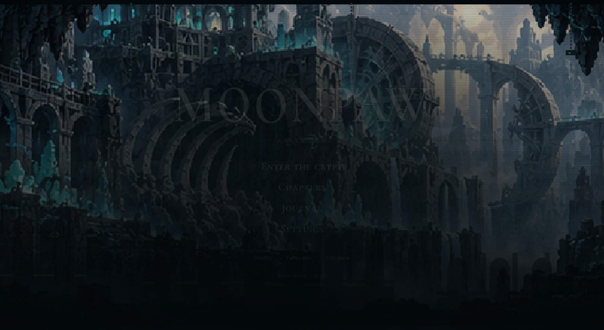

# MOONPAW: Chibi Roller

**Your reflection left before you.**

A monochrome horror platformer by **Adnan Naous**. Guide Noir through ten nights in a city that powers its lights with forgotten names. Run, jump, wall-jump and roll through larger interconnected rooftop routes. Choose who gets to go home.

This is a playable first release, developed from Adnan's original Grok pixel prototype. It is a complete small campaign with ten chapters, three endings, credits, and secrets; more art and balancing can continue from this foundation.



## Play

Windows: download the portable executable from [Releases](https://github.com/AdnanNaous/moonpaw-chibi-roller/releases). Double-click it; Node, a browser, and an internet connection are not needed to play. F11 toggles fullscreen. The first release is unsigned.

Android: download the `Android-test.apk` from [Releases](https://github.com/AdnanNaous/moonpaw-chibi-roller/releases/tag/v0.1.0). This is a debug-signed test build for Android 7.0+, with landscape touch controls. It compiled successfully in GitHub Actions; physical phone and controller testing remains pending.

Web and iOS: the same game builds as an offline installable web app, with a native Capacitor iOS project supplied. Native compilation needs Android SDK 36/JDK 21 or macOS/Xcode respectively.

| Action | Keyboard / mouse | Standard controller | Touch |
| --- | --- | --- | --- |
| Move | A/D or left/right arrows | Left stick / D-pad | Left/right buttons |
| Jump | Space, W, up, Z / left mouse | A | Jump |
| Roll / air dash | Shift, X / right mouse | X or B | Roll |
| Pause | Escape / P | Start | Pause button |

Hold jump for height; release for a short hop. Landing restores your air dash. Jump away from a wall to climb. Flags save your respawn point. Find the door to finish a chapter. Save data stays on this device.

## The ten nights

1. The Last Platform
2. Sawdust Chapel
3. Dead Air District
4. The Hanging Choir
5. Velvet Static
6. Orchard of Teeth
7. The Bell Foundry
8. Hospital of Light
9. The Hollow Moon
10. The Unwritten Door

Collect ten hidden memories to reveal the third ending. The title screen has a few secrets of its own.

## Develop

Node.js 22.12+ and pnpm 11 are required. Dependency versions are locked.

```sh
pnpm install --frozen-lockfile
pnpm dev
pnpm test
pnpm build
pnpm desktop
pnpm desktop:release
```

```sh
pnpm mobile:sync
pnpm android
pnpm ios
```

The web build goes to `dist/`; Windows output goes to `release/`. The game has no remote asset dependency. `scripts/compose_audio.py` regenerates the original WAV soundtrack and Foley with Python/NumPy; checked-in WAV files are ready to use.

## Project structure

- `src/core.ts`, `src/input.ts`: fixed-step gameplay and input
- `src/levels.ts`: authored maps and optional routes
- `src/renderer.ts`: layered 2.5D diorama, original cat and environmental art
- `src/story.ts`, `src/main.ts`: chapters, endings, UI and credits
- `src/audio.ts`, `public/audio/`: bundled original soundtrack and effects
- `electron/`, `android/`, `ios/`: application shells
- `tests/`, `docs/`: verification and design notes

The game uses a side-on camera and planar collisions. Lit depth layers give a 2.5D look; there is no free 3D camera. Graphics tiers cap resolution and adjust shadows/postprocessing. Backgrounding the app pauses gameplay.

## Credits & links

Created and directed by **Adnan Naous**. Engineering, procedural art, story and synthesized soundtrack developed with Codex. Original pixel prototype explored with Grok. Technology: Three.js, Electron, Capacitor, Vite and TypeScript.

[Portfolio](https://adnannaous.vercel.app) · [GitHub](https://github.com/AdnanNaous) · [X @vc_351](https://x.com/vc_351) · [LinkedIn](https://www.linkedin.com/in/adnan-naous/) · [All links](https://linktr.ee/VC351)

All visual meshes and audio in this repository were authored for this project; there are no downloaded art/sample packs. Third-party dependencies retain their own licenses. This repository does not currently grant an open-source license to the original game content.
